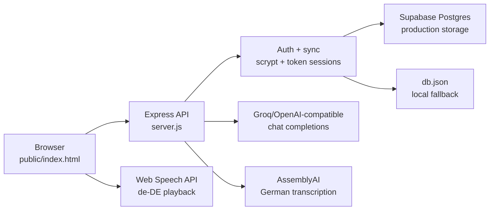

# DeutschLernen 🇩🇪

**A focused German learning app — built vanilla and deployable on free infrastructure. Practice what actually matters: speaking, listening, and real phrases.**

---

## Portfolio snapshot

DeutschLernen is a full-stack learning product built as a deliberately constrained engineering project: one vanilla frontend, one Express backend, AI/voice integrations, authenticated sync, and a deploy path that can run on free infrastructure.

What this demonstrates:

- Product thinking: practice loops for speaking, listening, grammar, vocabulary, review, and progress.
- Full-stack ownership: UI, auth, persistence, AI proxying, audio transcription, deployment, and verification scripts.
- Constraint-driven engineering: no frontend framework, no build step, minimal dependencies, and server-side protection for paid API keys.
- Learning science: spaced repetition, targeted grammar drills, error journal, daily goals, and progress history.

Public demo access is intentionally limited for now to avoid uncontrolled usage of paid AI and voice integrations. The app is Docker-ready for Hugging Face Spaces, and a public portfolio version can be shared later with sanitized seed data, screenshots, and usage limits.

---

## Why this exists

Most language apps optimise for engagement before learning. You can collect rewards, complete matching exercises, and still struggle to hold a conversation.

DeutschLernen is different. Every screen is a deliberate practice loop: speak with an AI, get corrected, shadow pronunciation, and drill the grammar you actually get wrong. The product still uses motivation mechanics, but they support the learning loop instead of replacing it.

---

## Features

| Category | What it does |
|----------|--------------|
| **Speaking** | AI role-play chat, accent correction with word-level diff, shadowing mode (listen → repeat → score), phrase breakdown |
| **Listening** | Dialogue comprehension with quiz questions, dictation with playback and scoring |
| **Vocabulary** | AI-generated phrases by topic, daily phrase, curated word packs (Travel, Tech, Food, Bureaucracy), searchable table with CSV export |
| **Grammar** | 10 AI-powered drill topics: articles, Perfekt, word order, adjective endings, separable verbs, Präteritum, connectors, Konjunktiv II, irregular plurals, conjugation |
| **Cases** | Offline 4-case trainer (Nominative/Akkusative/Dative/Genitive) — colour-coded, no AI needed |
| **SRS** | Custom 5-box Leitner spaced repetition (0/1/3/7/14/30 day intervals), grade each card, delete what you master |
| **Progress** | Historical level curve (SVG chart), weekly stats, error journal, personalised improvement tips, adaptive daily goal |
| **UI** | Light/dark themes, Duolingo-style icon system, 3D card flip, confetti on level-up, onboarding tour, responsive mobile-first |
| **Accessibility** | WCAG 2.x: focus traps, `aria-live`, ≥44px touch targets, non-colour feedback, screen-reader friendly |

---

## Technical highlights

| Area | What it shows |
|------|--------------|
| **Vanilla JS by choice** | ~5.7k-line single-file frontend, no framework, no build step, no transpiler |
| **Custom SRS engine** | Leitner algorithm with 5 boxes implemented on a flat data model |
| **AI orchestration** | Prompt engineering, defensive JSON parsing, multi-provider proxy, server-side key protection |
| **Serverless persistence** | Supabase (Postgres) with scrypt password hashing, token sessions, and cross-device sync |
| **Free deployment** | Docker container on Hugging Face Spaces, Node 22, secrets via platform |
| **Accessibility** | Designed with focus management, keyboard access, screen-reader states, contrast, and touch-target rules in mind |
| **Motivation design** | Streak, immediate progress feedback, micro-celebrations, gentle loss aversion — built for daily habit, not artificial engagement |

---

## Architecture



The browser never receives provider API keys. AI and voice requests are proxied through Express, and production refuses to fall back to `db.json` when Supabase secrets are missing.

---

## Stack

| Layer | Tech |
|-------|------|
| Frontend | Vanilla JS, CSS custom properties |
| Backend | Node.js + Express |
| AI | Groq `llama-3.3-70b-versatile` (OpenAI-compatible) |
| Voice in | AssemblyAI v2 |
| Voice out | Web Speech API `de-DE` |
| Auth | scrypt + 32-byte random tokens |
| Database | Supabase (Postgres) with `db.json` local fallback |
| Deploy | Hugging Face Spaces (Docker, Node 22) |

---

## Security and privacy

- API keys stay server-side: Groq/OpenAI-compatible and AssemblyAI calls are routed through Express.
- Authenticated AI/voice proxy endpoints require `x-token`.
- Passwords are stored with scrypt hashes; legacy SHA-256 hashes are upgraded on successful login.
- Session tokens are 32-byte random values with a 30-day inactivity expiry.
- Supabase service role credentials are used only by the backend.
- Production/Hugging Face startup fails fast if Supabase is not configured, avoiding accidental local-file persistence.
- `db.json` is a local-development fallback and should not be committed.

---

## Verification

```bash
node -c server.js
npm run verify:auth-sync
npm run verify:auth-sync:supabase
```

The verification script checks register/login/sync behavior, auth-protected proxy access, and can run against either local `db.json` storage or Supabase.

---

## Setup

```bash
git clone https://github.com/SEBASBELMOS/deutschlernen.git
cd deutschlernen
npm install
```

Create `.env`:

```
AI_KEY=gsk_...              # Groq API key (free at console.groq.com)
ASSEMBLY_KEY=...             # AssemblyAI key
PORT=3000

# Optional — for cross-device sync:
SUPABASE_URL=https://xxx.supabase.co
SUPABASE_SERVICE_KEY=eyJ...
```

Without Supabase, the app stores data in a local `db.json`. With Supabase, your data syncs across devices automatically.

```bash
node server.js
# → http://localhost:3000
```

---

## Screenshots

*Screenshots coming soon. The screenshots/ directory is prepared and will be populated with current app captures.*

---

## Project structure

```
deutschlernen/
├── public/
│   └── index.html           # Entire frontend: HTML + CSS + JS
├── server.js                # Express: auth, sync, AI/voice proxies
├── supabase-schema.sql      # Supabase table definitions
├── Dockerfile               # Node 22-slim, PORT=7860
├── scripts/
│   └── verify-auth-sync.js  # Deterministic auth/sync test
├── package.json
└── README.md
```

---

## Known limitations

- No public live demo is linked yet.
- Server-side `/api/chat` rate limiting and max-token clamping are planned before any broad public launch.
- PWA/offline mode, bulk vocabulary editing, and continuous hands-free voice conversation are still future work.

---

## Licence

No formal open-source licence is granted. All rights are reserved; the code is available for review as part of this portfolio, but reuse, redistribution, or derivative use requires written permission.
